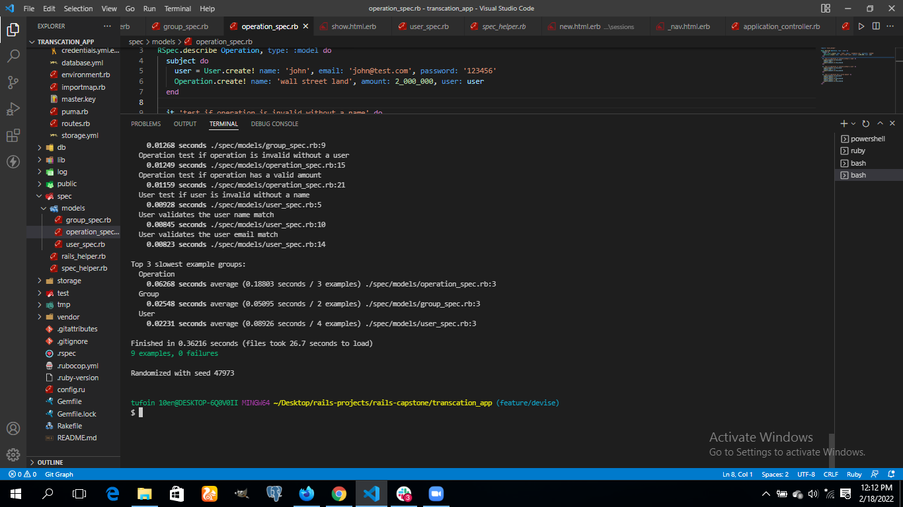

# Project Name
## Transaction App
This is a mobile Application(responsive), based on managing and analysing different categories of user transactions and checking what was spent on what by a particular user.

## Built With

* Ruby on Rails
* Rspec
* Psql
## Live
> [Heroku Live](https://my-transaction-app.herokuapp.com/users/sign_in)

## ERD DIAGRAM
> 

## RSpec Test
> 

## Getting Started

### Prerequisites

* Ruby (ruby --v 2.7.5)
* Postgrestsql (psql --version)
* Node.js (node --v)
* Yarn (yarn --v)

To get a local copy up and running follow these simple example steps.

Run in your terminal `git clone https://github.com/tufoinnkuo10/Transaction_App`

### Install RSpec

To run the tests locally :

* To instal RSpec for testing please run the following command on your terminal:

 ` gem install rspec`

 ` run rails rspec spec/models`

### Helpful links to solve some issues

* [Could not find gem](https://stackoverflow.com/questions/32491201/could-not-find-gem-pg-0-12-4-ruby-in-any-of-the-gem-sources-listed-in-your)
* [Install psql](https://harshityadav95.medium.com/postgresql-in-windows-subsystem-for-linux-wsl-6dc751ac1ff3)
* [PG:: InsufficientPrivilege: ERROR:  must be owner of database blog_app_development](https://stackoverflow.com/questions/25610753/activerecordstatementinvalid-pgerror-error-must-be-owner-of-database)

## Run the application
-connect to your psql
-  run `rails s` in your terminal

## Author

👤 **Tufoin Nkuo**
* GitHub: [@tufoinnkuo10](https://github.com/tufoinnkuo10)
* Twitter: [@itztenten](https://twitter.com/itztenten)
* LinkedIn: [@tufoinnkuo10](https://www.linkedin.com/in/tufoin-nkuo-3b272320b)

## 🤝 Contributing

Contributions, issues, and feature requests are welcome!

Feel free to check the [issues page](../../issues).

## Show your support

Give a ⭐️ if you like this project!

## Acknowledgments

- A special thanks to Microverse for inspiring this project. We are indebted to you all at Microverse
- A special thanks goes to all our peers at Microverse for being there for us.

- Credit to the author of the original design on Behance, [Gregoire Vella](https://www.behance.net/gallery/19759151/Snapscan-iOs-design-and-branding?tracking_source=)

## 📝 License

This project is [MIT](./MIT.md) licensed.
